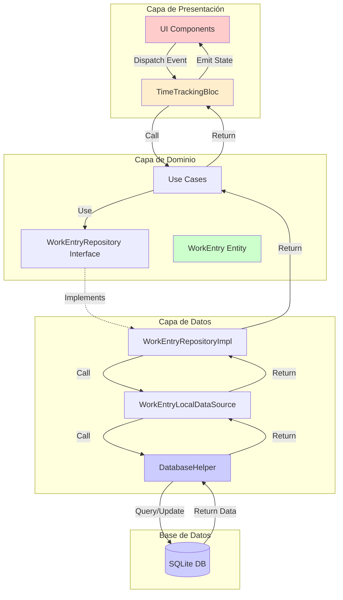

# Análisis Exhaustivo de Arquitectura - Time Register App

## 📋 Resumen Ejecutivo

**Aplicación:** Time Register - Aplicación Flutter para registro de horas de trabajo y cálculo de ganancias

**Arquitectura:** Clean Architecture con patrón BLoC para gestión de estado

**Estado de la Funcionalidad "Marcar como Cobrado":**
- ✅ **IMPLEMENTADO** en capa de datos (Base de datos, DataSource, Repository)
- ⚠️ **PARCIALMENTE IMPLEMENTADO** en capa de dominio (Event definido pero sin handler)
- ❌ **NO IMPLEMENTADO** en capa de presentación (UI sin controles interactivos)

---

## 🏗️ Arquitectura General

### Estructura de Capas

```
lib/
├── core/                          # Capa de Dominio
│   ├── database/                  # Gestión de base de datos
│   │   └── database_helper.dart   # SQLite helper
│   ├── entities/                  # Entidades de dominio
│   │   ├── work_entry.dart        # ✅ Campo isPaid implementado
│   │   └── settings.dart
│   ├── repositories/              # Interfaces de repositorios
│   │   ├── work_entry_repository.dart  # ✅ markEntryAsPaid() definido
│   │   └── settings_repository.dart
│   ├── usecases/                  # Casos de uso
│   │   ├── add_work_entry.dart
│   │   ├── update_work_entry.dart
│   │   ├── delete_work_entry.dart
│   │   ├── get_work_entries.dart
│   │   └── get_weekly_entries.dart
│   └── theme/
│       └── app_theme.dart
├── data/                          # Capa de Datos
│   ├── datasources/
│   │   ├── work_entry_local_data_source.dart  # ✅ markEntryAsPaid() implementado
│   │   └── settings_local_data_source.dart
│   ├── models/
│   │   └── work_entry_model.dart
│   └── repositories/
│       ├── work_entry_repository_impl.dart    # ✅ markEntryAsPaid() implementado
│       └── settings_repository_impl.dart
└── presentation/                  # Capa de Presentación
    ├── blocs/
    │   ├── time_tracking/
    │   │   ├── time_tracking_bloc.dart        # ⚠️ Sin handler para MarkEntryAsPaid
    │   │   ├── time_tracking_event.dart       # ✅ MarkEntryAsPaid event definido
    │   │   └── time_tracking_state.dart
    │   └── settings/
    │       ├── settings_bloc.dart
    │       ├── settings_event.dart
    │       └── settings_state.dart
    └── pages/
        ├── home_page.dart                     # ❌ Sin UI para marcar como cobrado
        ├── edit_entry_page.dart               # ❌ Sin UI para marcar como cobrado
        ├── add_entry_page.dart
        ├── weekly_summary_page.dart           # ✅ Muestra estado isPaid (solo lectura)
        └── settings_page.dart
```

---

## 🔍 Análisis Detallado por Capa

### 1. Capa de Base de Datos (SQLite)

**Archivo:** [`lib/core/database/database_helper.dart`](lib/core/database/database_helper.dart)

#### Esquema de Tabla `work_entries`

```sql
CREATE TABLE work_entries (
  id INTEGER PRIMARY KEY AUTOINCREMENT,
  date TEXT NOT NULL,
  start_time TEXT NOT NULL,
  end_time TEXT NOT NULL,
  lunch_taken INTEGER NOT NULL DEFAULT 0,
  total_hours REAL NOT NULL,
  hourly_rate REAL NOT NULL,
  earnings REAL NOT NULL,
  is_paid INTEGER NOT NULL DEFAULT 0,  -- ✅ Campo implementado
  created_at TEXT NOT NULL
)
```

#### Método Implementado

**Ubicación:** Líneas 165-173

```dart
Future<void> markEntryAsPaid(int id, bool isPaid) async {
  final db = await database;
  await db.update(
    'work_entries',
    {'is_paid': isPaid ? 1 : 0},
    where: 'id = ?',
    whereArgs: [id],
  );
}
```

**Estado:** ✅ **COMPLETAMENTE IMPLEMENTADO**

---

### 2. Capa de Entidad (Domain)

**Archivo:** [`lib/core/entities/work_entry.dart`](lib/core/entities/work_entry.dart)

#### Entidad WorkEntry

**Ubicación:** Líneas 1-101

```dart
class WorkEntry {
  final int? id;
  final DateTime date;
  final DateTime startTime;
  final DateTime endTime;
  final bool lunchTaken;
  final double totalHours;
  final double hourlyRate;
  final double earnings;
  final bool isPaid;              // ✅ Campo implementado
  final DateTime createdAt;
  
  // Constructor, fromMap, toMap, copyWith implementados correctamente
}
```

**Características:**
- ✅ Campo `isPaid` incluido en constructor (línea 22)
- ✅ Serialización/deserialización implementada (líneas 39-68)
- ✅ Método `copyWith` incluye `isPaid` (líneas 71-95)

**Estado:** ✅ **COMPLETAMENTE IMPLEMENTADO**

---

### 3. Capa de DataSource

**Archivo:** [`lib/data/datasources/work_entry_local_data_source.dart`](lib/data/datasources/work_entry_local_data_source.dart)

#### Interface y Implementación

**Ubicación:** Líneas 4-58

```dart
abstract class WorkEntryLocalDataSource {
  Future<void> markEntryAsPaid(int id, bool isPaid);  // ✅ Definido línea 11
}

class WorkEntryLocalDataSourceImpl implements WorkEntryLocalDataSource {
  @override
  Future<void> markEntryAsPaid(int id, bool isPaid) async {
    return await databaseHelper.markEntryAsPaid(id, isPaid);  // ✅ Implementado líneas 55-57
  }
}
```

**Estado:** ✅ **COMPLETAMENTE IMPLEMENTADO**

---

### 4. Capa de Repository

**Archivo:** [`lib/core/repositories/work_entry_repository.dart`](lib/core/repositories/work_entry_repository.dart)

#### Interface del Repositorio

**Ubicación:** Línea 10

```dart
abstract class WorkEntryRepository {
  Future<void> markEntryAsPaid(int id, bool isPaid);  // ✅ Definido
}
```

**Archivo:** [`lib/data/repositories/work_entry_repository_impl.dart`](lib/data/repositories/work_entry_repository_impl.dart)

#### Implementación del Repositorio

**Ubicación:** Líneas 45-48

```dart
@override
Future<void> markEntryAsPaid(int id, bool isPaid) async {
  return await localDataSource.markEntryAsPaid(id, isPaid);  // ✅ Implementado
}
```

**Estado:** ✅ **COMPLETAMENTE IMPLEMENTADO**

---

### 5. Capa de BLoC (Gestión de Estado)

**Archivo:** [`lib/presentation/blocs/time_tracking/time_tracking_event.dart`](lib/presentation/blocs/time_tracking/time_tracking_event.dart)

#### Event Definido

**Ubicación:** Líneas 25-30

```dart
class MarkEntryAsPaid extends TimeTrackingEvent {
  final int id;
  final bool isPaid;

  MarkEntryAsPaid(this.id, this.isPaid);  // ✅ Event definido
}
```

**Archivo:** [`lib/presentation/blocs/time_tracking/time_tracking_bloc.dart`](lib/presentation/blocs/time_tracking/time_tracking_bloc.dart)

#### BLoC Implementation

**Ubicación:** Líneas 1-78

```dart
class TimeTrackingBloc extends Bloc<TimeTrackingEvent, TimeTrackingState> {
  TimeTrackingBloc({
    required this.getWorkEntries,
    required this.addWorkEntry,
    required this.updateWorkEntry,
    required this.deleteWorkEntry,
  }) : super(TimeTrackingInitial()) {
    on<LoadWorkEntries>(_onLoadWorkEntries);
    on<AddWorkEntry>(_onAddWorkEntry);
    on<UpdateWorkEntry>(_onUpdateWorkEntry);
    on<DeleteWorkEntry>(_onDeleteWorkEntry);
    // ❌ FALTA: on<MarkEntryAsPaid>(_onMarkEntryAsPaid);
  }
  
  // ❌ FALTA: Método _onMarkEntryAsPaid no implementado
}
```

**Estado:** ⚠️ **PARCIALMENTE IMPLEMENTADO** - Event definido pero sin handler

---

### 6. Capa de Presentación (UI)

#### 6.1 Home Page

**Archivo:** [`lib/presentation/pages/home_page.dart`](lib/presentation/pages/home_page.dart)

**Ubicación:** Líneas 288-320

```dart
// ✅ Muestra badge "Paid" cuando isPaid es true
if (entry.isPaid)
  Container(
    padding: const EdgeInsets.symmetric(horizontal: 8, vertical: 4),
    decoration: BoxDecoration(
      color: Colors.green.shade50,
      borderRadius: BorderRadius.circular(12),
      border: Border.all(color: Colors.green.shade200),
    ),
    child: Row(
      mainAxisSize: MainAxisSize.min,
      children: [
        FaIcon(FontAwesomeIcons.circleCheck, size: 12, color: Colors.green.shade700),
        const SizedBox(width: 4),
        Text('Paid', style: TextStyle(fontSize: 11, fontWeight: FontWeight.bold, color: Colors.green.shade700)),
      ],
    ),
  ),
```

**Funcionalidad Actual:**
- ✅ Visualiza el estado `isPaid` con un badge verde
- ❌ **NO permite cambiar el estado** (sin botón/switch interactivo)

**Estado:** ⚠️ **SOLO LECTURA** - Falta interactividad

---

#### 6.2 Edit Entry Page

**Archivo:** [`lib/presentation/pages/edit_entry_page.dart`](lib/presentation/pages/edit_entry_page.dart)

**Ubicación:** Líneas 1-415

**Funcionalidad Actual:**
- ✅ Permite editar fecha, hora inicio/fin, lunch, tarifa horaria
- ❌ **NO incluye control para cambiar isPaid**
- ❌ No hay switch, checkbox o botón para marcar como cobrado

**Estado:** ❌ **NO IMPLEMENTADO** - Falta UI completa

---

#### 6.3 Weekly Summary Page

**Archivo:** [`lib/presentation/pages/weekly_summary_page.dart`](lib/presentation/pages/weekly_summary_page.dart)

**Ubicación:** Líneas 18-34, 239-244

```dart
// ✅ Filtros implementados
bool _showPaidOnly = false;
bool _showUnpaidOnly = false;

List<WorkEntry> _filterEntries(List<WorkEntry> entries) {
  if (_showPaidOnly) {
    return entries.where((e) => e.isPaid).toList();
  } else if (_showUnpaidOnly) {
    return entries.where((e) => !e.isPaid).toList();
  }
  return entries;
}

// ✅ Visualización del estado
leading: FaIcon(
  entry.isPaid ? FontAwesomeIcons.circleCheck : FontAwesomeIcons.clock,
  color: entry.isPaid ? Colors.green : Colors.orange,
  size: 20,
),
```

**Funcionalidad Actual:**
- ✅ Muestra estado isPaid con iconos
- ✅ Permite filtrar por pagado/no pagado
- ❌ **NO permite cambiar el estado** desde esta vista

**Estado:** ⚠️ **SOLO LECTURA CON FILTROS**

---

## 🔄 Flujo de Datos Actual



---

## 📊 Estado de Implementación por Componente

| Componente | Archivo | Líneas | Estado | Funcionalidad |
|------------|---------|--------|--------|---------------|
| **Base de Datos** | `database_helper.dart` | 165-173 | ✅ Completo | `markEntryAsPaid()` implementado |
| **Entidad** | `work_entry.dart` | 10, 22, 49, 65, 80 | ✅ Completo | Campo `isPaid` en toda la entidad |
| **DataSource Interface** | `work_entry_local_data_source.dart` | 11 | ✅ Completo | Método definido |
| **DataSource Impl** | `work_entry_local_data_source.dart` | 55-57 | ✅ Completo | Método implementado |
| **Repository Interface** | `work_entry_repository.dart` | 10 | ✅ Completo | Método definido |
| **Repository Impl** | `work_entry_repository_impl.dart` | 45-48 | ✅ Completo | Método implementado |
| **BLoC Event** | `time_tracking_event.dart` | 25-30 | ✅ Completo | `MarkEntryAsPaid` definido |
| **BLoC Handler** | `time_tracking_bloc.dart` | N/A | ❌ Falta | Handler no registrado |
| **Use Case** | N/A | N/A | ❌ Falta | `MarkEntryAsPaid` use case no existe |
| **Home Page UI** | `home_page.dart` | 288-320 | ⚠️ Parcial | Solo visualización |
| **Edit Page UI** | `edit_entry_page.dart` | N/A | ❌ Falta | Sin control para isPaid |
| **Summary Page UI** | `weekly_summary_page.dart` | 239-244 | ⚠️ Parcial | Solo visualización + filtros |

---

## 🎯 Hallazgos Clave

### ✅ Lo que ESTÁ Implementado

1. **Persistencia de Datos Completa**
   - Campo `is_paid` en tabla SQLite
   - Método `markEntryAsPaid()` en DatabaseHelper
   - Conversión correcta entre entidad y base de datos

2. **Capa de Datos Completa**
   - DataSource con método `markEntryAsPaid()`
   - Repository con método `markEntryAsPaid()`
   - Toda la infraestructura de datos lista

3. **Visualización del Estado**
   - Badge "Paid" en HomePage
   - Iconos diferenciados en WeeklySummaryPage
   - Filtros por estado pagado/no pagado

### ❌ Lo que FALTA Implementar

1. **Capa de Dominio (Use Cases)**
   - Crear `MarkEntryAsPaid` use case
   - Inyectar en el BLoC

2. **BLoC Layer**
   - Implementar handler `_onMarkEntryAsPaid`
   - Registrar el handler en el constructor
   - Actualizar dependencias en `main.dart`

3. **Capa de Presentación (UI)**
   - **HomePage:** Agregar botón/switch para marcar como cobrado
   - **EditEntryPage:** Agregar switch para cambiar estado isPaid
   - Implementar confirmación de cambio de estado
   - Feedback visual al usuario

---

## 🔐 Consideraciones de Seguridad y Validación

### Validaciones Necesarias

1. **Validación de Estado**
   - No permitir marcar como no pagado si ya está pagado (opcional, según reglas de negocio)
   - Confirmación antes de cambiar estado

2. **Validación de Permisos**
   - Actualmente no hay sistema de autenticación
   - Considerar si se necesita protección adicional

3. **Integridad de Datos**
   - Verificar que el entry existe antes de actualizar
   - Manejar errores de base de datos

### Manejo de Errores

1. **Errores de Base de Datos**
   - Capturar excepciones en operaciones SQLite
   - Mostrar mensajes de error al usuario

2. **Estados Inconsistentes**
   - Recargar lista después de cambiar estado
   - Manejar casos donde el entry fue eliminado

---

## 📱 Experiencia de Usuario Actual vs Deseada

### Estado Actual

```
Usuario ve entry → Entry muestra badge "Paid" si isPaid=true
                 → Usuario NO puede cambiar el estado
                 → Debe editar manualmente en base de datos
```

### Estado Deseado

```
Usuario ve entry → Toca botón "Mark as Paid"
                 → Confirmación (opcional)
                 → Estado actualizado en BD
                 → UI actualizada automáticamente
                 → Feedback visual (SnackBar)
```

---

## 🎨 Propuestas de UI

### Opción 1: Botón en Card (HomePage)

```dart
// Agregar botón flotante en cada card
IconButton(
  icon: FaIcon(
    entry.isPaid ? FontAwesomeIcons.circleCheck : FontAwesomeIcons.circle,
    color: entry.isPaid ? Colors.green : Colors.grey,
  ),
  onPressed: () {
    context.read<TimeTrackingBloc>().add(
      MarkEntryAsPaid(entry.id!, !entry.isPaid)
    );
  },
)
```

### Opción 2: Switch en EditEntryPage

```dart
// Agregar switch en formulario de edición
SwitchListTile(
  title: const Text('Mark as Paid'),
  subtitle: const Text('This entry has been paid'),
  value: _isPaid,
  onChanged: (bool value) {
    setState(() {
      _isPaid = value;
    });
  },
)
```

### Opción 3: Menú Contextual (Long Press)

```dart
// Agregar menú al mantener presionado
onLongPress: () {
  showModalBottomSheet(
    context: context,
    builder: (context) => Column(
      children: [
        ListTile(
          leading: FaIcon(FontAwesomeIcons.circleCheck),
          title: Text('Mark as Paid'),
          onTap: () {
            // Marcar como pagado
          },
        ),
      ],
    ),
  );
}
```

---

## 📈 Métricas de Completitud

| Capa | Completitud | Componentes Faltantes |
|------|-------------|----------------------|
| Base de Datos | 100% | 0 |
| Entidades | 100% | 0 |
| DataSource | 100% | 0 |
| Repository | 100% | 0 |
| Use Cases | 0% | 1 (MarkEntryAsPaid) |
| BLoC | 50% | 1 (Handler) |
| UI | 30% | 2 (Controles interactivos) |
| **TOTAL** | **68%** | **4 componentes** |

---

## 🎯 Conclusión

La funcionalidad de "marcar como cobrado" está **68% implementada**. La infraestructura de datos está completa y funcional, pero falta la integración en las capas superiores (use case, BLoC handler) y los controles de UI para que los usuarios puedan interactuar con esta funcionalidad.

**Próximo Paso:** Crear plan de implementación detallado para completar el 32% restante.