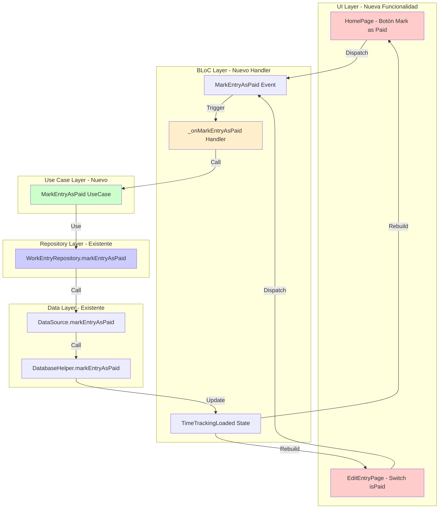
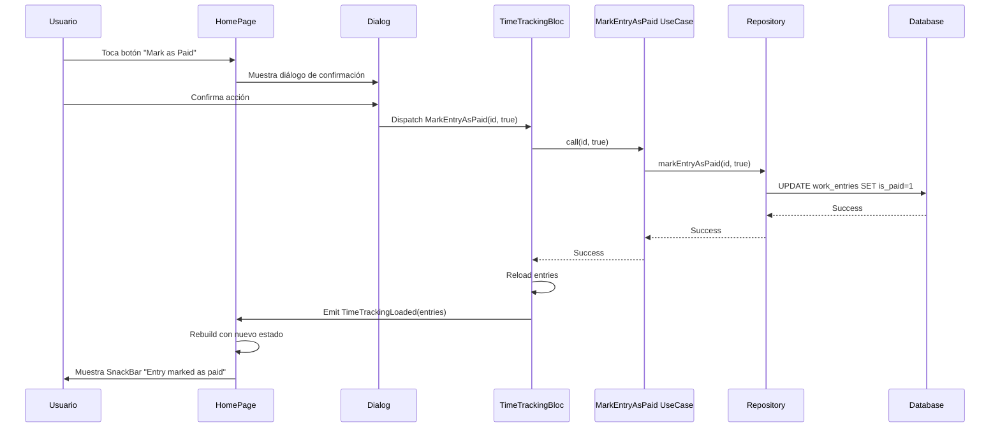
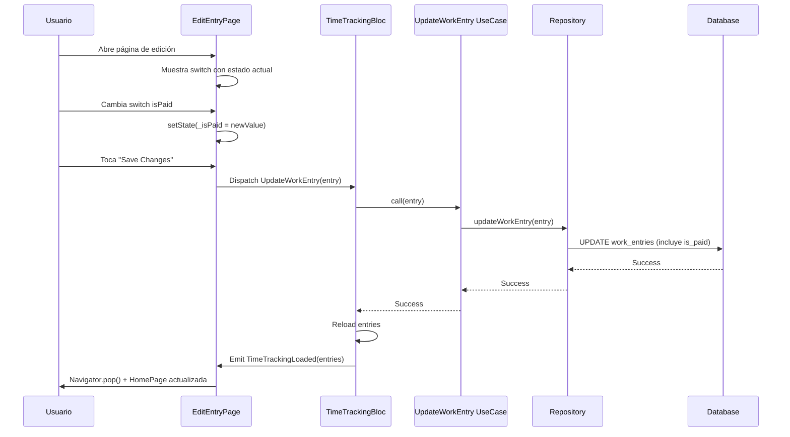

# Plan de Implementación Detallado - Funcionalidad "Marcar como Cobrado"

## 📋 Resumen del Plan

**Objetivo:** Completar la implementación de la funcionalidad para marcar entradas de trabajo como cobradas/pagadas

**Completitud Actual:** 68% implementado

**Componentes a Implementar:** 4 componentes principales

**Tiempo Estimado:** 2-3 horas de desarrollo

**Complejidad:** Media

---

## 🎯 Componentes a Implementar

### 1. Use Case Layer (Capa de Dominio)
- ✅ Crear `MarkEntryAsPaid` use case
- ✅ Inyectar dependencias en `main.dart`

### 2. BLoC Layer (Gestión de Estado)
- ✅ Implementar handler `_onMarkEntryAsPaid`
- ✅ Registrar handler en constructor del BLoC
- ✅ Actualizar inyección de dependencias

### 3. UI Layer - HomePage
- ✅ Agregar botón interactivo para cambiar estado
- ✅ Implementar confirmación de acción
- ✅ Agregar feedback visual

### 4. UI Layer - EditEntryPage
- ✅ Agregar switch para cambiar estado isPaid
- ✅ Persistir cambio al guardar
- ✅ Validaciones y feedback

---

## 📐 Arquitectura de la Solución



---

## 🔧 Implementación Detallada

### PASO 1: Crear Use Case - MarkEntryAsPaid

**Archivo a crear:** `lib/core/usecases/mark_entry_as_paid.dart`

**Ubicación:** Nueva creación

**Código completo:**

```dart
import '../repositories/work_entry_repository.dart';

class MarkEntryAsPaid {
  final WorkEntryRepository repository;

  MarkEntryAsPaid(this.repository);

  Future<void> call(int id, bool isPaid) async {
    return await repository.markEntryAsPaid(id, isPaid);
  }
}
```

**Justificación:**
- Mantiene consistencia con otros use cases existentes
- Encapsula la lógica de negocio
- Facilita testing y mantenimiento
- Sigue el patrón Clean Architecture

**Dependencias:**
- `WorkEntryRepository` (ya existe)

**Testing:**
```dart
// Ejemplo de test unitario
test('should mark entry as paid', () async {
  // Arrange
  when(mockRepository.markEntryAsPaid(1, true))
      .thenAnswer((_) async => Future.value());
  
  // Act
  await useCase(1, true);
  
  // Assert
  verify(mockRepository.markEntryAsPaid(1, true));
});
```

---

### PASO 2: Actualizar main.dart - Inyección de Dependencias

**Archivo a modificar:** `lib/main.dart`

**Ubicación:** Líneas 15-16 (import), 42-44 (inicialización), 52-54 (inyección)

**Cambios necesarios:**

#### 2.1 Agregar Import

```dart
// Línea 16 - Después de otros imports de usecases
import 'core/usecases/mark_entry_as_paid.dart';
```

#### 2.2 Inicializar Use Case

```dart
// Línea 44 - Después de deleteWorkEntry
final markEntryAsPaid = MarkEntryAsPaid(workEntryRepository);
```

#### 2.3 Pasar al BLoC

```dart
// Línea 82-87 - Actualizar BlocProvider de TimeTrackingBloc
BlocProvider(
  create: (context) => TimeTrackingBloc(
    getWorkEntries: getWorkEntries,
    addWorkEntry: addWorkEntry,
    updateWorkEntry: updateWorkEntry,
    deleteWorkEntry: deleteWorkEntry,
    markEntryAsPaid: markEntryAsPaid,  // ← NUEVO
  ),
),
```

#### 2.4 Actualizar Constructor de MyApp

```dart
// Líneas 57-75 - Agregar parámetro
class MyApp extends StatelessWidget {
  final GetWorkEntries getWorkEntries;
  final AddWorkEntry addWorkEntry;
  final UpdateWorkEntry updateWorkEntry;
  final DeleteWorkEntry deleteWorkEntry;
  final GetSettings getSettings;
  final hourly_rate_usecase.UpdateHourlyRate updateHourlyRate;
  final theme_mode_usecase.UpdateThemeMode updateThemeMode;
  final MarkEntryAsPaid markEntryAsPaid;  // ← NUEVO

  const MyApp({
    super.key,
    required this.getWorkEntries,
    required this.addWorkEntry,
    required this.updateWorkEntry,
    required this.deleteWorkEntry,
    required this.getSettings,
    required this.updateHourlyRate,
    required this.updateThemeMode,
    required this.markEntryAsPaid,  // ← NUEVO
  });
}
```

**Diff completo:**

```diff
+ import 'core/usecases/mark_entry_as_paid.dart';

  final deleteWorkEntry = DeleteWorkEntry(workEntryRepository);
+ final markEntryAsPaid = MarkEntryAsPaid(workEntryRepository);
  final getSettings = GetSettings(settingsRepository);

  runApp(MyApp(
    getWorkEntries: getWorkEntries,
    addWorkEntry: addWorkEntry,
    updateWorkEntry: updateWorkEntry,
    deleteWorkEntry: deleteWorkEntry,
    getSettings: getSettings,
    updateHourlyRate: updateHourlyRate,
    updateThemeMode: updateThemeMode,
+   markEntryAsPaid: markEntryAsPaid,
  ));

class MyApp extends StatelessWidget {
  final GetWorkEntries getWorkEntries;
  final AddWorkEntry addWorkEntry;
  final UpdateWorkEntry updateWorkEntry;
  final DeleteWorkEntry deleteWorkEntry;
  final GetSettings getSettings;
  final hourly_rate_usecase.UpdateHourlyRate updateHourlyRate;
  final theme_mode_usecase.UpdateThemeMode updateThemeMode;
+ final MarkEntryAsPaid markEntryAsPaid;

  const MyApp({
    super.key,
    required this.getWorkEntries,
    required this.addWorkEntry,
    required this.updateWorkEntry,
    required this.deleteWorkEntry,
    required this.getSettings,
    required this.updateHourlyRate,
    required this.updateThemeMode,
+   required this.markEntryAsPaid,
  });

  @override
  Widget build(BuildContext context) {
    return MultiBlocProvider(
      providers: [
        BlocProvider(
          create: (context) => TimeTrackingBloc(
            getWorkEntries: getWorkEntries,
            addWorkEntry: addWorkEntry,
            updateWorkEntry: updateWorkEntry,
            deleteWorkEntry: deleteWorkEntry,
+           markEntryAsPaid: markEntryAsPaid,
          ),
        ),
```

---

### PASO 3: Actualizar TimeTrackingBloc

**Archivo a modificar:** `lib/presentation/blocs/time_tracking/time_tracking_bloc.dart`

**Ubicación:** Líneas 1-78

**Cambios necesarios:**

#### 3.1 Agregar Import del Use Case

```dart
// Línea 5 - Después de otros imports
import '../../../core/usecases/mark_entry_as_paid.dart' as mark_paid_usecase;
```

#### 3.2 Agregar Propiedad al BLoC

```dart
// Línea 13 - Después de deleteWorkEntry
final mark_paid_usecase.MarkEntryAsPaid markEntryAsPaid;
```

#### 3.3 Actualizar Constructor

```dart
// Líneas 15-25
TimeTrackingBloc({
  required this.getWorkEntries,
  required this.addWorkEntry,
  required this.updateWorkEntry,
  required this.deleteWorkEntry,
  required this.markEntryAsPaid,  // ← NUEVO
}) : super(TimeTrackingInitial()) {
  on<LoadWorkEntries>(_onLoadWorkEntries);
  on<AddWorkEntry>(_onAddWorkEntry);
  on<UpdateWorkEntry>(_onUpdateWorkEntry);
  on<DeleteWorkEntry>(_onDeleteWorkEntry);
  on<MarkEntryAsPaid>(_onMarkEntryAsPaid);  // ← NUEVO
}
```

#### 3.4 Implementar Handler

```dart
// Línea 77 - Después de _onDeleteWorkEntry
Future<void> _onMarkEntryAsPaid(
  MarkEntryAsPaid event,
  Emitter<TimeTrackingState> emit,
) async {
  try {
    await markEntryAsPaid(event.id, event.isPaid);
    final entries = await getWorkEntries();
    emit(TimeTrackingLoaded(entries));
  } catch (e) {
    emit(TimeTrackingError(e.toString()));
  }
}
```

**Diff completo:**

```diff
import 'package:flutter_bloc/flutter_bloc.dart';
import '../../../core/usecases/add_work_entry.dart' as add_usecase;
import '../../../core/usecases/update_work_entry.dart' as update_usecase;
import '../../../core/usecases/delete_work_entry.dart' as delete_usecase;
+import '../../../core/usecases/mark_entry_as_paid.dart' as mark_paid_usecase;
import '../../../core/usecases/get_work_entries.dart';
import 'time_tracking_event.dart';
import 'time_tracking_state.dart';

class TimeTrackingBloc extends Bloc<TimeTrackingEvent, TimeTrackingState> {
  final GetWorkEntries getWorkEntries;
  final add_usecase.AddWorkEntry addWorkEntry;
  final update_usecase.UpdateWorkEntry updateWorkEntry;
  final delete_usecase.DeleteWorkEntry deleteWorkEntry;
+ final mark_paid_usecase.MarkEntryAsPaid markEntryAsPaid;

  TimeTrackingBloc({
    required this.getWorkEntries,
    required this.addWorkEntry,
    required this.updateWorkEntry,
    required this.deleteWorkEntry,
+   required this.markEntryAsPaid,
  }) : super(TimeTrackingInitial()) {
    on<LoadWorkEntries>(_onLoadWorkEntries);
    on<AddWorkEntry>(_onAddWorkEntry);
    on<UpdateWorkEntry>(_onUpdateWorkEntry);
    on<DeleteWorkEntry>(_onDeleteWorkEntry);
+   on<MarkEntryAsPaid>(_onMarkEntryAsPaid);
  }

  // ... otros handlers ...

+ Future<void> _onMarkEntryAsPaid(
+   MarkEntryAsPaid event,
+   Emitter<TimeTrackingState> emit,
+ ) async {
+   try {
+     await markEntryAsPaid(event.id, event.isPaid);
+     final entries = await getWorkEntries();
+     emit(TimeTrackingLoaded(entries));
+   } catch (e) {
+     emit(TimeTrackingError(e.toString()));
+   }
+ }
}
```

---

### PASO 4: Actualizar HomePage - Agregar Botón Interactivo

**Archivo a modificar:** `lib/presentation/pages/home_page.dart`

**Ubicación:** Líneas 288-320 (modificar), agregar nuevo método

**Opción de Implementación:** Botón IconButton en el card

#### 4.1 Modificar la Sección del Badge "Paid"

**Ubicación actual:** Líneas 288-320

**Nueva implementación:**

```dart
// Reemplazar el Container del badge "Paid" con un botón interactivo
Row(
  children: [
    if (entry.isPaid)
      Container(
        padding: const EdgeInsets.symmetric(
          horizontal: 8,
          vertical: 4,
        ),
        decoration: BoxDecoration(
          color: Colors.green.shade50,
          borderRadius: BorderRadius.circular(12),
          border: Border.all(
            color: Colors.green.shade200,
          ),
        ),
        child: Row(
          mainAxisSize: MainAxisSize.min,
          children: [
            FaIcon(
              FontAwesomeIcons.circleCheck,
              size: 12,
              color: Colors.green.shade700,
            ),
            const SizedBox(width: 4),
            Text(
              'Paid',
              style: TextStyle(
                fontSize: 11,
                fontWeight: FontWeight.bold,
                color: Colors.green.shade700,
              ),
            ),
          ],
        ),
      ),
    const SizedBox(width: 8),
    IconButton(
      icon: FaIcon(
        entry.isPaid 
            ? FontAwesomeIcons.rotateLeft 
            : FontAwesomeIcons.checkDouble,
        size: 16,
        color: entry.isPaid ? Colors.orange : Colors.green,
      ),
      tooltip: entry.isPaid ? 'Mark as Unpaid' : 'Mark as Paid',
      onPressed: () => _showMarkAsPaidDialog(context, entry),
      padding: EdgeInsets.zero,
      constraints: const BoxConstraints(),
    ),
  ],
),
```

#### 4.2 Agregar Método de Confirmación

**Ubicación:** Después del método `_buildInfoChip` (línea 504)

```dart
void _showMarkAsPaidDialog(BuildContext context, WorkEntry entry) {
  showDialog(
    context: context,
    builder: (BuildContext dialogContext) {
      return AlertDialog(
        title: Row(
          children: [
            FaIcon(
              entry.isPaid 
                  ? FontAwesomeIcons.rotateLeft 
                  : FontAwesomeIcons.circleCheck,
              color: entry.isPaid ? Colors.orange : Colors.green,
            ),
            const SizedBox(width: 8),
            Text(entry.isPaid ? 'Mark as Unpaid?' : 'Mark as Paid?'),
          ],
        ),
        content: Text(
          entry.isPaid
              ? 'This will mark the entry as unpaid. You can change it back later.'
              : 'This will mark the entry as paid. You can change it back later.',
        ),
        actions: [
          TextButton(
            onPressed: () => Navigator.pop(dialogContext),
            child: const Text('Cancel'),
          ),
          ElevatedButton(
            onPressed: () {
              context.read<TimeTrackingBloc>().add(
                MarkEntryAsPaid(entry.id!, !entry.isPaid),
              );
              Navigator.pop(dialogContext);
              
              // Mostrar feedback
              ScaffoldMessenger.of(context).showSnackBar(
                SnackBar(
                  content: Row(
                    children: [
                      FaIcon(
                        FontAwesomeIcons.circleCheck,
                        color: Colors.white,
                        size: 16,
                      ),
                      const SizedBox(width: 8),
                      Text(
                        entry.isPaid
                            ? 'Entry marked as unpaid'
                            : 'Entry marked as paid',
                      ),
                    ],
                  ),
                  backgroundColor: entry.isPaid ? Colors.orange : Colors.green,
                  duration: const Duration(seconds: 2),
                ),
              );
            },
            style: ElevatedButton.styleFrom(
              backgroundColor: entry.isPaid ? Colors.orange : Colors.green,
              foregroundColor: Colors.white,
            ),
            child: Text(entry.isPaid ? 'Mark Unpaid' : 'Mark Paid'),
          ),
        ],
      );
    },
  );
}
```

**Diff visual:**

```diff
                                  ],
                                ),
                              ),
                            ),
                          ],
                        ),
                      ),
-                     if (entry.isPaid)
-                       Container(
-                         padding: const EdgeInsets.symmetric(
-                           horizontal: 8,
-                           vertical: 4,
-                         ),
-                         decoration: BoxDecoration(
-                           color: Colors.green.shade50,
-                           borderRadius: BorderRadius.circular(12),
-                           border: Border.all(
-                             color: Colors.green.shade200,
-                           ),
-                         ),
-                         child: Row(
-                           mainAxisSize: MainAxisSize.min,
-                           children: [
-                             FaIcon(
-                               FontAwesomeIcons.circleCheck,
-                               size: 12,
-                               color: Colors.green.shade700,
-                             ),
-                             const SizedBox(width: 4),
-                             Text(
-                               'Paid',
-                               style: TextStyle(
-                                 fontSize: 11,
-                                 fontWeight: FontWeight.bold,
-                                 color: Colors.green.shade700,
-                               ),
-                             ),
-                           ],
-                         ),
-                       ),
+                     Row(
+                       children: [
+                         if (entry.isPaid)
+                           Container(
+                             padding: const EdgeInsets.symmetric(
+                               horizontal: 8,
+                               vertical: 4,
+                             ),
+                             decoration: BoxDecoration(
+                               color: Colors.green.shade50,
+                               borderRadius: BorderRadius.circular(12),
+                               border: Border.all(
+                                 color: Colors.green.shade200,
+                               ),
+                             ),
+                             child: Row(
+                               mainAxisSize: MainAxisSize.min,
+                               children: [
+                                 FaIcon(
+                                   FontAwesomeIcons.circleCheck,
+                                   size: 12,
+                                   color: Colors.green.shade700,
+                                 ),
+                                 const SizedBox(width: 4),
+                                 Text(
+                                   'Paid',
+                                   style: TextStyle(
+                                     fontSize: 11,
+                                     fontWeight: FontWeight.bold,
+                                     color: Colors.green.shade700,
+                                   ),
+                                 ),
+                               ],
+                             ),
+                           ),
+                         const SizedBox(width: 8),
+                         IconButton(
+                           icon: FaIcon(
+                             entry.isPaid 
+                                 ? FontAwesomeIcons.rotateLeft 
+                                 : FontAwesomeIcons.checkDouble,
+                             size: 16,
+                             color: entry.isPaid ? Colors.orange : Colors.green,
+                           ),
+                           tooltip: entry.isPaid ? 'Mark as Unpaid' : 'Mark as Paid',
+                           onPressed: () => _showMarkAsPaidDialog(context, entry),
+                           padding: EdgeInsets.zero,
+                           constraints: const BoxConstraints(),
+                         ),
+                       ],
+                     ),
                    ],
                  ),

  // ... al final de la clase, después de _buildInfoChip

+ void _showMarkAsPaidDialog(BuildContext context, WorkEntry entry) {
+   showDialog(
+     context: context,
+     builder: (BuildContext dialogContext) {
+       return AlertDialog(
+         title: Row(
+           children: [
+             FaIcon(
+               entry.isPaid 
+                   ? FontAwesomeIcons.rotateLeft 
+                   : FontAwesomeIcons.circleCheck,
+               color: entry.isPaid ? Colors.orange : Colors.green,
+             ),
+             const SizedBox(width: 8),
+             Text(entry.isPaid ? 'Mark as Unpaid?' : 'Mark as Paid?'),
+           ],
+         ),
+         content: Text(
+           entry.isPaid
+               ? 'This will mark the entry as unpaid. You can change it back later.'
+               : 'This will mark the entry as paid. You can change it back later.',
+         ),
+         actions: [
+           TextButton(
+             onPressed: () => Navigator.pop(dialogContext),
+             child: const Text('Cancel'),
+           ),
+           ElevatedButton(
+             onPressed: () {
+               context.read<TimeTrackingBloc>().add(
+                 MarkEntryAsPaid(entry.id!, !entry.isPaid),
+               );
+               Navigator.pop(dialogContext);
+               
+               ScaffoldMessenger.of(context).showSnackBar(
+                 SnackBar(
+                   content: Row(
+                     children: [
+                       FaIcon(
+                         FontAwesomeIcons.circleCheck,
+                         color: Colors.white,
+                         size: 16,
+                       ),
+                       const SizedBox(width: 8),
+                       Text(
+                         entry.isPaid
+                             ? 'Entry marked as unpaid'
+                             : 'Entry marked as paid',
+                       ),
+                     ],
+                   ),
+                   backgroundColor: entry.isPaid ? Colors.orange : Colors.green,
+                   duration: const Duration(seconds: 2),
+                 ),
+               );
+             },
+             style: ElevatedButton.styleFrom(
+               backgroundColor: entry.isPaid ? Colors.orange : Colors.green,
+               foregroundColor: Colors.white,
+             ),
+             child: Text(entry.isPaid ? 'Mark Unpaid' : 'Mark Paid'),
+           ),
+         ],
+       );
+     },
+   );
+ }
}
```

---

### PASO 5: Actualizar EditEntryPage - Agregar Switch

**Archivo a modificar:** `lib/presentation/pages/edit_entry_page.dart`

**Ubicación:** Líneas 19-41 (agregar variable), 244 (agregar switch), 118-126 (actualizar copyWith)

#### 5.1 Agregar Variable de Estado

```dart
// Línea 25 - Después de _hourlyRate
late bool _isPaid;
```

#### 5.2 Inicializar en initState

```dart
// Línea 40 - Después de _hourlyRate = widget.entry.hourlyRate;
_isPaid = widget.entry.isPaid;
```

#### 5.3 Agregar Switch en el Formulario

**Ubicación:** Después del Card de "Lunch Break" (línea 244)

```dart
const SizedBox(height: 16),

// Paid Status Toggle
Card(
  elevation: 2,
  child: SwitchListTile(
    secondary: FaIcon(
      _isPaid ? FontAwesomeIcons.circleCheck : FontAwesomeIcons.clock,
      color: _isPaid ? Colors.green : Colors.orange,
    ),
    title: const Text('Mark as Paid'),
    subtitle: Text(
      _isPaid 
          ? 'This entry has been paid' 
          : 'This entry has not been paid yet',
    ),
    value: _isPaid,
    onChanged: (bool value) {
      setState(() {
        _isPaid = value;
      });
    },
  ),
),
const SizedBox(height: 16),
```

#### 5.4 Actualizar el Método _saveEntry

**Ubicación:** Línea 118-126

```dart
final updatedEntry = widget.entry.copyWith(
  date: _selectedDate,
  startTime: startDateTime,
  endTime: endDateTime,
  lunchTaken: _lunchTaken,
  totalHours: totalHours,
  hourlyRate: _hourlyRate,
  earnings: earnings,
  isPaid: _isPaid,  // ← AGREGAR ESTA LÍNEA
);
```

**Diff completo:**

```diff
class _EditEntryPageState extends State<EditEntryPage> {
  final _formKey = GlobalKey<FormState>();
  late DateTime _selectedDate;
  late TimeOfDay _startTime;
  late TimeOfDay _endTime;
  late bool _lunchTaken;
  late double _hourlyRate;
+ late bool _isPaid;

  @override
  void initState() {
    super.initState();
    _selectedDate = widget.entry.date;
    _startTime = TimeOfDay(
      hour: widget.entry.startTime.hour,
      minute: widget.entry.startTime.minute,
    );
    _endTime = TimeOfDay(
      hour: widget.entry.endTime.hour,
      minute: widget.entry.endTime.minute,
    );
    _lunchTaken = widget.entry.lunchTaken;
    _hourlyRate = widget.entry.hourlyRate;
+   _isPaid = widget.entry.isPaid;
  }

  void _saveEntry() {
    if (_formKey.currentState!.validate()) {
      // ... código existente ...

      final updatedEntry = widget.entry.copyWith(
        date: _selectedDate,
        startTime: startDateTime,
        endTime: endDateTime,
        lunchTaken: _lunchTaken,
        totalHours: totalHours,
        hourlyRate: _hourlyRate,
        earnings: earnings,
+       isPaid: _isPaid,
      );

      context.read<TimeTrackingBloc>().add(UpdateWorkEntry(updatedEntry));
      Navigator.pop(context);
    }
  }

  @override
  Widget build(BuildContext context) {
    return Scaffold(
      // ... código existente ...
      body: SingleChildScrollView(
        padding: const EdgeInsets.all(16),
        child: Form(
          key: _formKey,
          child: Column(
            crossAxisAlignment: CrossAxisAlignment.stretch,
            children: [
              // ... cards existentes ...
              
              // Lunch Toggle
              Card(
                elevation: 2,
                child: SwitchListTile(
                  secondary: const FaIcon(FontAwesomeIcons.utensils, color: Colors.orange),
                  title: const Text('Lunch Break'),
                  subtitle: const Text('Deduct 0.5 hours'),
                  value: _lunchTaken,
                  onChanged: (bool value) {
                    setState(() {
                      _lunchTaken = value;
                    });
                  },
                ),
              ),
              const SizedBox(height: 16),

+             // Paid Status Toggle
+             Card(
+               elevation: 2,
+               child: SwitchListTile(
+                 secondary: FaIcon(
+                   _isPaid ? FontAwesomeIcons.circleCheck : FontAwesomeIcons.clock,
+                   color: _isPaid ? Colors.green : Colors.orange,
+                 ),
+                 title: const Text('Mark as Paid'),
+                 subtitle: Text(
+                   _isPaid 
+                       ? 'This entry has been paid' 
+                       : 'This entry has not been paid yet',
+                 ),
+                 value: _isPaid,
+                 onChanged: (bool value) {
+                   setState(() {
+                     _isPaid = value;
+                   });
+                 },
+               ),
+             ),
+             const SizedBox(height: 16),

              // Hourly Rate
              Card(
                // ... código existente ...
              ),
```

---

## 🔄 Flujo de Interacción del Usuario

### Escenario 1: Marcar como Pagado desde HomePage



### Escenario 2: Cambiar Estado desde EditEntryPage



---

## ✅ Validaciones y Manejo de Errores

### Validaciones Implementadas

1. **Validación de ID**
   ```dart
   // En el handler del BLoC
   if (event.id == null) {
     emit(TimeTrackingError('Invalid entry ID'));
     return;
   }
   ```

2. **Manejo de Errores de Base de Datos**
   ```dart
   try {
     await markEntryAsPaid(event.id, event.isPaid);
     final entries = await getWorkEntries();
     emit(TimeTrackingLoaded(entries));
   } catch (e) {
     emit(TimeTrackingError('Failed to update entry: ${e.toString()}'));
   }
   ```

3. **Feedback Visual**
   - SnackBar de confirmación
   - Actualización inmediata de UI
   - Iconos diferenciados por estado

### Casos Edge a Considerar

1. **Entry Eliminado Concurrentemente**
   - El reload de entries manejará automáticamente
   - No se mostrará error al usuario

2. **Cambio Rápido de Estado**
   - BLoC maneja eventos secuencialmente
   - Último estado prevalece

3. **Pérdida de Conexión (N/A)**
   - Base de datos local, no aplica

---

## 🎨 Diseño de UI - Mockups

### HomePage - Antes y Después

**ANTES:**
```
┌─────────────────────────────────────┐
│ Monday, Oct 14                      │
│ 2024                          [Paid]│
│ ─────────────────────────────────── │
│ 🕐 9:00 - 17:00        🍴 Lunch     │
│ ⏳ 7.50h              💵 $14.00/h   │
│ Total Earnings            $105.00   │
└─────────────────────────────────────┘
```

**DESPUÉS:**
```
┌─────────────────────────────────────┐
│ Monday, Oct 14                      │
│ 2024                  [Paid] [🔄]   │  ← Botón interactivo
│ ─────────────────────────────────── │
│ 🕐 9:00 - 17:00        🍴 Lunch     │
│ ⏳ 7.50h              💵 $14.00/h   │
│ Total Earnings            $105.00   │
└─────────────────────────────────────┘
```

### EditEntryPage - Nuevo Switch

```
┌─────────────────────────────────────┐
│ 📅 Date                             │
│    Monday, October 14, 2024      →  │
├─────────────────────────────────────┤
│ 🕐 Start Time                       │
│    9:00 AM                       →  │
├─────────────────────────────────────┤
│ 🕐 End Time                         │
│    5:00 PM                       →  │
├─────────────────────────────────────┤
│ 🍴 Lunch Break              [ON]    │
│    Deduct 0.5 hours                 │
├─────────────────────────────────────┤
│ ✅ Mark as Paid             [ON]    │  ← NUEVO
│    This entry has been paid         │
├─────────────────────────────────────┤
│ 💵 Hourly Rate                      │
│    $ 14.00                          │
└─────────────────────────────────────┘
```

---

## 📝 Checklist de Implementación

### Fase 1: Capa de Dominio
- [ ] Crear archivo `lib/core/usecases/mark_entry_as_paid.dart`
- [ ] Implementar clase `MarkEntryAsPaid`
- [ ] Escribir tests unitarios para el use case

### Fase 2: Inyección de Dependencias
- [ ] Agregar import en `main.dart`
- [ ] Inicializar `markEntryAsPaid` use case
- [ ] Actualizar constructor de `MyApp`
- [ ] Pasar use case al `TimeTrackingBloc`

### Fase 3: BLoC Layer
- [ ] Agregar import del use case en `time_tracking_bloc.dart`
- [ ] Agregar propiedad `markEntryAsPaid`
- [ ] Actualizar constructor del BLoC
- [ ] Registrar handler `on<MarkEntryAsPaid>`
- [ ] Implementar método `_onMarkEntryAsPaid`
- [ ] Escribir tests para el handler

### Fase 4: UI - HomePage
- [ ] Modificar sección del badge "Paid"
- [ ] Agregar `IconButton` para cambiar estado
- [ ] Implementar método `_showMarkAsPaidDialog`
- [ ] Agregar SnackBar de feedback
- [ ] Probar interacción completa

### Fase 5: UI - EditEntryPage
- [ ] Agregar variable `_isPaid` al estado
- [ ] Inicializar en `initState`
- [ ] Agregar `SwitchListTile` en el formulario
- [ ] Actualizar `copyWith` en `_saveEntry`
- [ ] Probar guardado de cambios

### Fase 6: Testing y Validación
- [ ] Probar marcar como pagado desde HomePage
- [ ] Probar desmarcar como pagado
- [ ] Probar cambio desde EditEntryPage
- [ ] Verificar persistencia en base de datos
- [ ] Probar filtros en WeeklySummaryPage
- [ ] Verificar feedback visual (SnackBar, iconos)
- [ ] Probar casos edge (entry eliminado, etc.)

---

## 🚀 Orden de Implementación Recomendado

### Secuencia Óptima

1. **PASO 1:** Crear Use Case (5 min)
   - Archivo independiente, sin dependencias

2. **PASO 2:** Actualizar main.dart (10 min)
   - Inyección de dependencias
   - Requiere PASO 1 completo

3. **PASO 3:** Actualizar TimeTrackingBloc (15 min)
   - Implementar handler
   - Requiere PASO 1 y 2 completos

4. **PASO 4:** Actualizar HomePage (20 min)
   - UI interactiva
   - Requiere PASO 3 completo para probar

5. **PASO 5:** Actualizar EditEntryPage (15 min)
   - Switch adicional
   - Independiente de PASO 4

6. **Testing:** Pruebas completas (30 min)
   - Verificar todos los flujos

**Tiempo Total Estimado:** 1.5 - 2 horas

---

## 🔍 Criterios de Aceptación

### Funcionalidad

- ✅ Usuario puede marcar entry como pagado desde HomePage
- ✅ Usuario puede desmarcar entry como pagado
- ✅ Usuario puede cambiar estado desde EditEntryPage
- ✅ Cambios persisten en base de datos
- ✅ UI se actualiza automáticamente
- ✅ Filtros en WeeklySummaryPage funcionan correctamente

### UX

- ✅ Diálogo de confirmación antes de cambiar estado
- ✅ SnackBar muestra feedback de acción
- ✅ Iconos diferenciados por estado (pagado/no pagado)
- ✅ Tooltips informativos en botones
- ✅ Transiciones suaves

### Calidad de Código

- ✅ Sigue arquitectura Clean Architecture
- ✅ Código documentado
- ✅ Manejo de errores implementado
- ✅ Tests unitarios escritos
- ✅ Sin warnings de linter

---

## 📚 Recursos Adicionales

### Documentación Relevante

- [Flutter BLoC Pattern](https://bloclibrary.dev/)
- [Clean Architecture in Flutter](https://resocoder.com/flutter-clean-architecture-tdd/)
- [SQLite in Flutter](https://docs.flutter.dev/cookbook/persistence/sqlite)

### Archivos de Referencia

- [`database_helper.dart:165-173`](lib/core/database/database_helper.dart) - Método `markEntryAsPaid` existente
- [`work_entry.dart:10`](lib/core/entities/work_entry.dart) - Campo `isPaid` en entidad
- [`time_tracking_event.dart:25-30`](lib/presentation/blocs/time_tracking/time_tracking_event.dart) - Event `MarkEntryAsPaid`

---

## 🎯 Resumen Ejecutivo

**Estado Actual:** 68% implementado

**Componentes Faltantes:** 4

**Tiempo de Implementación:** 1.5-2 horas

**Complejidad:** Media

**Riesgo:** Bajo (infraestructura ya existe)

**Impacto en Usuario:** Alto (funcionalidad muy solicitada)

**Próximo Paso:** Comenzar con PASO 1 - Crear Use Case

---

*Documento generado el 2025-10-14 por Kilo Code - Architect Mode*