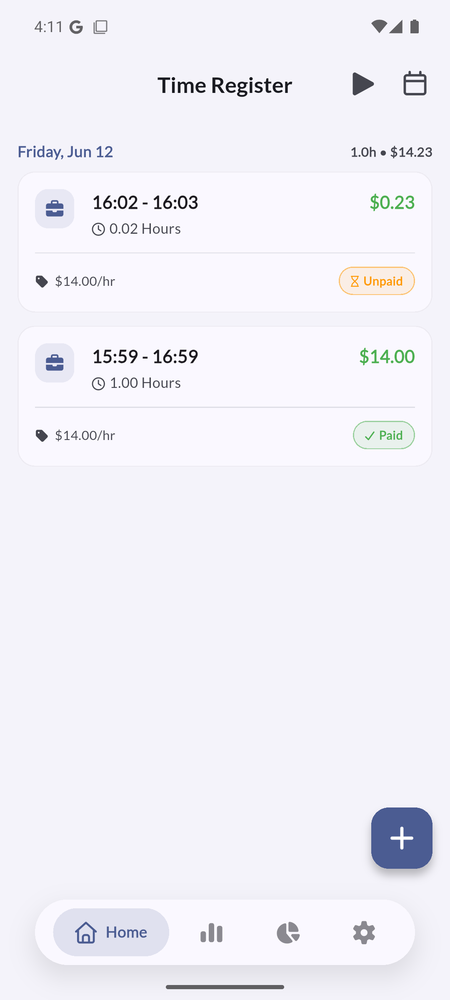
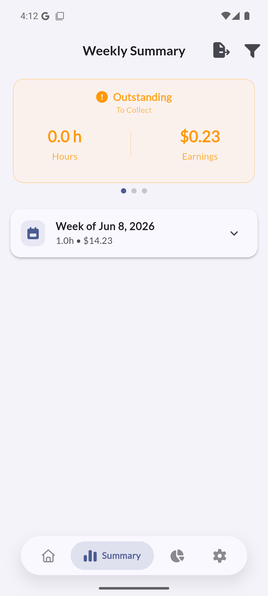
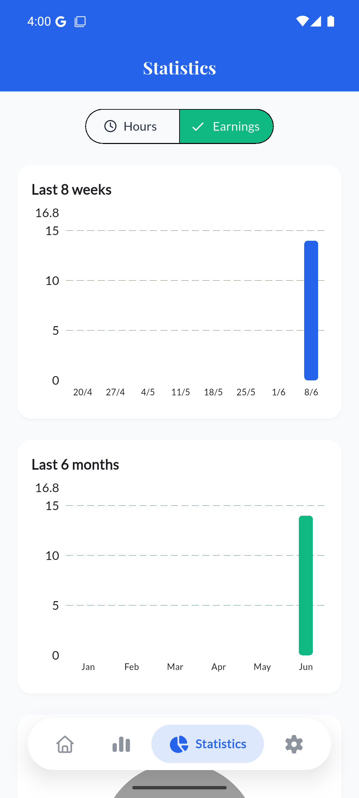
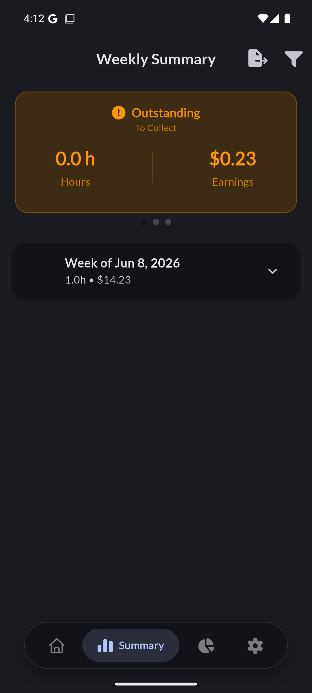
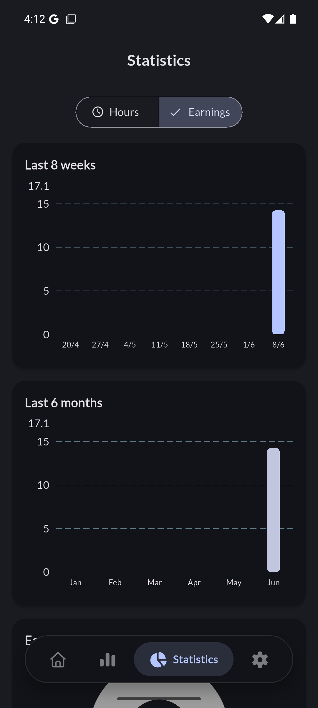

# Time Register

[](https://github.com/davidmenendez9901/time_register/actions/workflows/ci.yml)
[](LICENSE)

A Flutter application for tracking daily work hours and calculating earnings. Perfect for freelancers, consultants, and hourly workers who need to keep accurate records of their time and income.

All data stays on your device — no account, no cloud, no tracking. The app is **100% offline** and released as **open source** under the MIT License.

## 🎯 Features

### ⏰ Time Tracking
- **Easy Entry Creation**: Simple form to log work hours with start/end times
- **Live Timer**: Clock in/out from the home screen; the running shift survives app restarts
- **Jobs / Clients**: Organize entries by job, each with its own color and optional hourly rate
- **Overnight Shifts**: Shifts that cross midnight (e.g. 22:00 – 06:00) are handled automatically
- **Lunch Break Control**: Optional lunch break with custom start/end times
- **Notes**: Attach a description to any entry
- **Automatic Calculations**: Real-time calculation of total hours and earnings
- **Edit & Delete**: Full CRUD operations for work entries

### 💰 Payment Management
- **Payment Status**: Mark entries as paid or unpaid
- **Outstanding Balance**: See at a glance how much you are owed
- **Filtering**: View all, paid only, or unpaid entries
- **Per-Entry Rate**: Each entry keeps the hourly rate it was created with
- **CSV & PDF Export**: Share your entries (all, paid, or unpaid) as a spreadsheet-ready file or a printable work report
- **Backup & Restore**: Save everything to a file and load it on a new device

### 📊 Summaries
- **Weekly Grouping**: Entries organized by work weeks with expandable details
- **This Week / This Month / Outstanding** summary cards
- **Statistics**: Bar charts for the last 8 weeks and 6 months (hours or earnings) and an earnings-by-job breakdown
- **Daily Totals**: Hours and earnings per day on the home screen
- **Date Filter**: Jump to any day's entries

### ⚙️ Customization
- **Hourly Rate**: Configurable default rate for new entries
- **Currency Symbol**: Use $, €, or any symbol you like
- **Deduction Estimates**: Optional percentage (taxes etc.) showing net earnings; fully hidden when disabled
- **Theme Support**: Light, dark, and system theme modes with four color palettes
- **Languages**: English and Spanish
- **Persistent Settings**: All configurations saved locally

## 🌐 Website

Check out the landing page: **<https://davidmenendez9901.github.io/time_register/>**

## 📱 Screenshots

| Home | Summary | Statistics |
|------|---------|------------|
|  |  |  |

| Summary (dark) | Statistics (dark) |
|----------------|-------------------|
|  |  |

## 🏗️ Architecture

Clean Architecture, local SQLite, BLoC/Cubit. No backend.

- **Presentation** (`lib/presentation/`): pages, widgets, `TimeTrackingBloc`, `SettingsBloc`, `ShiftTimerCubit`, `JobsCubit`
- **Domain** (`lib/core/`): entities, use cases, repository interfaces, migrations, pure exporters/stats
- **Data** (`lib/data/`): SQLite data sources, repository impls, backup service

```
lib/
├── core/            # Domain layer
│   ├── entities/    # WorkEntry, AppSettings, Job
│   ├── usecases/    # Business logic
│   ├── repositories/# Repository interfaces
│   ├── database/    # SQLite helper (schema v9) + desktop FFI
│   ├── utils/       # CSV/PDF, backup codec, stats
│   └── theme/       # Material 3 palettes
├── data/            # Data layer
│   ├── datasources/ # Local data sources
│   ├── models/      # Data models
│   ├── repositories/# Repository implementations
│   └── services/    # BackupService
├── presentation/    # UI layer
│   ├── blocs/       # State management
│   ├── pages/       # Screen widgets
│   ├── widgets/     # Reusable components
│   └── utils/       # UI helpers
└── l10n/            # Localization (en, es)
```

Engineering docs: [architecture](docs/ARCHITECTURE.md) · [developer guide](docs/DEVELOPER.md)

## 🚀 Getting Started

### Prerequisites
- Flutter SDK **3.44.1** (stable; the version CI uses)
- Dart SDK `^3.9.2` (see `environment.sdk` in `pubspec.yaml`)
- Android Studio / VS Code
- Android device or emulator (primary target; iOS and macOS also build)

### Installation

```bash
git clone https://github.com/davidmenendez9901/time_register.git
cd time_register
flutter pub get
flutter run
```

### Running the checks

```bash
dart format lib test
flutter analyze
flutter test
```

Setup, migrations, and pitfalls: [docs/DEVELOPER.md](docs/DEVELOPER.md).

## 📦 Main Dependencies

- **flutter_bloc**: State management
- **sqflite** / **sqflite_common_ffi**: Local SQLite (FFI on Linux/Windows)
- **intl** + **flutter_localizations**: Date formatting and localization
- **font_awesome_flutter**: Icons
- **google_fonts**: Typography (runtime fetch disabled; Lato bundled)
- **animations**: Page transitions
- **csv** + **pdf** + **share_plus**: Spreadsheet and printable exports
- **file_selector**: Restore-from-file picker
- **fl_chart**: Statistics charts
- **url_launcher**: Opens the published privacy policy in the system browser

## 🗄️ Database Schema

SQLite file `time_register.db`, schema **version 9**. Times are stored as `HH:mm`;
the `date` column is `yyyy-MM-dd`. Overnight shifts (end before start) are resolved
when the row is read, not by storing a second date. Version 9 adds indexes on
`date`, `job_id`, and `is_paid`.

### Work Entries Table
```sql
CREATE TABLE work_entries (
  id INTEGER PRIMARY KEY AUTOINCREMENT,
  date TEXT NOT NULL,
  start_time TEXT NOT NULL,
  end_time TEXT NOT NULL,
  lunch_taken INTEGER NOT NULL DEFAULT 0,
  total_hours REAL NOT NULL,
  hourly_rate REAL NOT NULL,
  earnings REAL NOT NULL,
  is_paid INTEGER NOT NULL DEFAULT 0,
  created_at TEXT NOT NULL,
  lunch_start_time TEXT,
  lunch_end_time TEXT,
  description TEXT,
  job_id INTEGER
)
```

### Settings Table
```sql
CREATE TABLE settings (
  id INTEGER PRIMARY KEY AUTOINCREMENT,
  hourly_rate REAL NOT NULL DEFAULT 0.0,
  theme_mode TEXT NOT NULL DEFAULT 'system',
  app_palette TEXT NOT NULL DEFAULT 'Blue',
  currency_symbol TEXT NOT NULL DEFAULT '$',
  active_shift_start TEXT,
  deductions_enabled INTEGER NOT NULL DEFAULT 0,
  deduction_rate REAL NOT NULL DEFAULT 0.0
)
```

### Jobs Table
```sql
CREATE TABLE jobs (
  id INTEGER PRIMARY KEY AUTOINCREMENT,
  name TEXT NOT NULL,
  color INTEGER NOT NULL,
  hourly_rate REAL,
  archived INTEGER NOT NULL DEFAULT 0
)
```

Column-level notes and migration history: [docs/ARCHITECTURE.md](docs/ARCHITECTURE.md).

## 🔒 Privacy & Security

Time Register is designed to work **fully offline**:

- **Local data only**: hours, rates and jobs live in SQLite on the device
- **No accounts, analytics, ads or crash reporters**
- **No network in release**: Android release has no `INTERNET` permission; fonts are bundled so they are never downloaded
- **User-controlled backup**: export/import JSON yourself; the OS cloud backup of the database is disabled
- **Open source**: inspect every line in this repository (MIT)

See the full [Privacy Policy](PRIVACY_POLICY.md).

## 📱 Platform Support

- ✅ Android (primary target, Play Store)
- ✅ iOS
- ✅ macOS
- 🧪 Linux / Windows (SQLite via FFI; not a store target yet)
- ❌ Flutter web client (the marketing site in `docs/` is static HTML only)

Please do not add network, telemetry or account code without an issue discussing it first — this project stays offline-first and open source.

## 🚀 Roadmap

- [x] CSV export
- [x] Backup and restore
- [x] Live timer (clock in / clock out)
- [x] Multiple jobs/clients with per-job rates
- [x] Tax/deduction estimates (optional, off by default)
- [x] Charts and analytics
- [x] PDF export
- [ ] Overtime rules (1.5x / 2x after N hours)
- [ ] Shift templates

## 🤝 Contributing

Contributions are welcome! Please read [CONTRIBUTING.md](CONTRIBUTING.md) for setup instructions and guidelines, then open a pull request.

## 📄 License

This project is licensed under the MIT License — see the [LICENSE](LICENSE) file for details.

---

**Time Register** — Track your time, calculate your earnings, stay organized.
