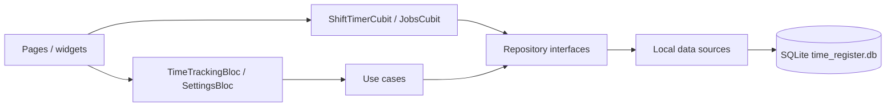

# Architecture — Time Register

Time Register is an offline Flutter app for logging work hours and calculating
earnings. All state lives in a local SQLite database. There is no account, no
backend, and the Android **release** build has no `INTERNET` permission.

This document describes how the current code is structured. For setup,
migrations, and troubleshooting, see [DEVELOPER.md](DEVELOPER.md).

## Layers

The project follows Clean Architecture with BLoC/Cubit at the UI boundary.
Dependencies point inward: UI → use cases → repository interfaces → data.

| Layer | Path | Responsibility |
|-------|------|----------------|
| Presentation | `lib/presentation/` | Pages, widgets, BLoCs/Cubits |
| Domain | `lib/core/` | Entities, use cases, repository interfaces, SQLite helper, pure utils |
| Data | `lib/data/` | Local data sources, models, repository implementations, backup I/O |

Composition root: `lib/main.dart`. It calls `initDesktopSqliteIfNeeded()` (FFI
factory on Linux/Windows), disables Google Fonts runtime fetch, then wires
`DatabaseHelper` → data sources → repositories → use cases →
`MultiBlocProvider`. There is no DI framework.

```
lib/
├── core/
│   ├── database/      # SQLite (DatabaseHelper v9, desktop FFI)
│   ├── entities/      # WorkEntry, AppSettings, Job
│   ├── repositories/  # Abstract repositories
│   ├── usecases/      # One class per operation
│   ├── theme/         # Material 3 palettes
│   └── utils/         # CSV/PDF exporters, backup codec, stats (no I/O)
├── data/
│   ├── datasources/   # SQLite access
│   ├── models/        # WorkEntryModel
│   ├── repositories/  # Implementations
│   └── services/      # BackupService (file JSON ↔ database)
├── presentation/
│   ├── blocs/         # TimeTrackingBloc, SettingsBloc, ShiftTimerCubit, JobsCubit
│   ├── pages/         # Home, summary, stats, settings, jobs, entry form
│   ├── widgets/       # Floating nav, active-shift banner
│   └── utils/         # Currency helper
└── l10n/              # ARB sources + generated localizations (en, es)
```

`GetWeeklyEntries` exists in `lib/core/usecases/` but is **not** used by the
UI. Home, Summary, and Stats all read the in-memory `TimeTrackingBloc` list.

## Screens and state

`HomePage` hosts four tabs in an `IndexedStack` plus a floating nav bar and a
gradient scrim so content fades as it scrolls behind the bar:

| Tab | Page | Reads |
|-----|------|--------|
| Home | `HomeContent` | entries, live shift, jobs |
| Summary | `WeeklySummaryPage` | entries grouped by ISO week (Monday start) |
| Statistics | `StatsPage` | last 8 weeks, last 6 months, earnings-by-job this month |
| Settings | `SettingsPage` | rates, theme, currency, deductions, backup, jobs, privacy link |



| Store | State | Persistence |
|-------|-------|-------------|
| `TimeTrackingBloc` | All `WorkEntry` rows | `work_entries` |
| `SettingsBloc` | `AppSettings` | `settings` (except the live shift) |
| `ShiftTimerCubit` | `DateTime?` clock-in | `settings.active_shift_start` |
| `JobsCubit` | `List<Job>` including archived | `jobs` |

`TimeTrackingBloc` keeps the list in memory. After add / update / delete /
mark-paid it patches that list (sorted by date desc, then `createdAt` desc)
instead of re-querying SQLite. A full reload happens only on
`LoadWorkEntries`, or when the current state is not `TimeTrackingLoaded`.
`LoadWorkEntries` does **not** emit `TimeTrackingLoading` if a list is already
on screen (avoids a spinner flash). Add uses the insert `id` via
`entry.copyWith(id: id)`.

`SettingsBloc` likewise skips the loading state when settings are already
loaded. `MaterialApp` rebuilds only when `themeMode` or `palette` changes
(`buildWhen` in `main.dart`), so rate/currency edits do not rebuild the tree.

Cubits reload their own lists after each write.

## Domain rules (verified in code)

### Hours and earnings

`WorkEntry.calculateTotalHours` uses minute precision. If lunch is enabled and
both lunch times are set, that duration is subtracted; otherwise a **0.5 h**
fallback is used (legacy rows). Hours are clamped at 0. Earnings are
`totalHours * hourlyRate` and are **snapshotted on the row** — later rate
changes do not rewrite history.

The per-entry rate is filled from, in order: the selected job’s optional rate
(only when that job has one), else the global default in Settings (or `14.0`
if settings have not loaded yet). Changing job on the form applies the job
rate only when that job has one; it does not revert to the global default.

New entries always persist `isPaid: false`. The paid switch is edit-mode only.
Home and Summary can toggle paid via `MarkEntryAsPaid` (no confirm dialog).

The form rejects a zero-length shift (`end == start`). If lunch is on, lunch
must have a non-zero duration and lunch end must not be after shift end
(`lunchWithinShift`). Inline field errors also raise a snackbar
(`fixFormErrors`) because the invalid field may be scrolled out of view.

### Overnight shifts

Times are stored as `HH:mm` on the entry’s `date`. If end &lt; start, the shift
crosses midnight and end is treated as the next calendar day. Lunch times use
the same rule.

### Jobs

- Optional `hourly_rate` overrides the global default when creating/editing.
- Color is one of eight presets in `jobs_page.dart` (`jobColors`).
- Archiving hides the job from the form picker except if it is already on the
  entry being edited. Archived jobs stay in the jobs list (struck through).
- Deleting a job **unlinks** entries (`job_id = NULL`); entries are kept.
  `job_id` is not a SQLite foreign key.

### Deductions

Optional percentage (0–100) stored on settings. Off by default. When enabled,
net is `gross * (1 - rate/100)` in the UI and on the PDF totals line. It is an
estimate only — not written onto `work_entries`.

### Weeks and stats

Weeks start Monday (`date.weekday - 1`). `weeklyTotals` / `monthlyTotals` fill
empty periods with zeros. `earningsByJob` on the stats tab covers the current
calendar month `[firstOfMonth, firstOfNextMonth)`.

## Persistence

Database file: app documents directory / `time_register.db`. Current schema
version: **9**. Never edit an existing migration; add a new `oldVersion < N`
block. See [DEVELOPER.md](DEVELOPER.md#database-migrations).

Indexes (created in `_onCreate` and in migration 9):

- `idx_work_entries_date`
- `idx_work_entries_job_id`
- `idx_work_entries_is_paid`

### `work_entries`

| Column | Notes |
|--------|--------|
| `date` | `yyyy-MM-dd` |
| `start_time`, `end_time` | `HH:mm` |
| `lunch_taken` | 0/1 |
| `lunch_start_time`, `lunch_end_time` | nullable `HH:mm` |
| `total_hours`, `hourly_rate`, `earnings` | stored numbers |
| `is_paid` | 0/1 |
| `description` | nullable |
| `job_id` | nullable FK-like (no SQLite FK constraint) |
| `created_at` | ISO-8601 |

### `settings` (single row, `id = 1`)

`hourly_rate` (default 14.0), `theme_mode` (`light`/`dark`/`system`),
`app_palette` (`Blue`/`Purple`/`Green`/`Orange`), `currency_symbol`,
`active_shift_start` (ISO-8601 or null), `deductions_enabled`, `deduction_rate`.

`AppSettings` does **not** include the live shift; that column is owned by
`ShiftTimerCubit`.

### `jobs`

`name`, `color` (ARGB int), `hourly_rate` (nullable), `archived` (0/1).

## Offline and privacy constraints

- `GoogleFonts.config.allowRuntimeFetching = false` in `main()`. UI typeface
  is bundled **Lato** (`GoogleFonts.latoTextTheme`). PDF export loads
  `Lato-Regular.ttf` / `Lato-Bold.ttf` via `rootBundle`.
- Android **release** has no `INTERNET` permission (debug/profile manifests
  add it for the Flutter tool). `url_launcher` opens the published privacy
  page in the **system browser** (`LaunchMode.externalApplication`); the
  app itself does not fetch that URL. The main manifest declares a
  `https` `VIEW` query for package visibility.
- OS cloud backup of the database is disabled
  (`android:allowBackup="false"`, `backup_rules.xml` /
  `data_extraction_rules.xml` exclude `time_register.db`).
- Do not add network calls or telemetry without an explicit product decision.

## Related docs

- Product overview and schema snapshot: [README](../README.md)
- Setup, runbooks, pitfalls: [DEVELOPER.md](DEVELOPER.md)
- Contributing checklist: [CONTRIBUTING.md](../CONTRIBUTING.md)
- Play Store upload kit: [play_store/README.md](../play_store/README.md)
