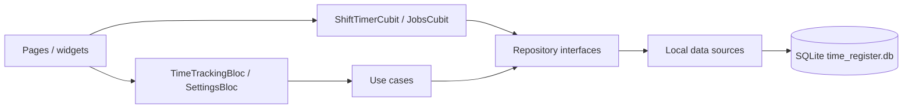

# Architecture — Time Register

Time Register is an offline Flutter app for logging work hours and calculating
earnings. All state lives in a local SQLite database. There is no account, no
backend, and the Android **release** build has no `INTERNET` permission.

This document describes how the current code is structured. For setup,
migrations, and troubleshooting, see [DEVELOPER.md](DEVELOPER.md).

## Layers

The project follows Clean Architecture with BLoC/Cubit at the UI boundary.
Dependencies point inward: UI → use cases → repository interfaces → data.

| Layer | Path | Responsibility |
|-------|------|----------------|
| Presentation | `lib/presentation/` | Pages, widgets, BLoCs/Cubits |
| Domain | `lib/core/` | Entities, use cases, repository interfaces, SQLite helper, pure utils |
| Data | `lib/data/` | Local data sources, models, repository implementations, backup I/O |

Composition root: `lib/main.dart`. It calls `initDesktopSqliteIfNeeded()` (FFI
factory on Linux/Windows), `initAppPlatform()` (iPad-on-Mac detection), disables
Google Fonts runtime fetch, optionally seeds demo data, then wires
`DatabaseHelper` → data sources → repositories → use cases →
`MultiBlocProvider`. There is no DI framework. `DatabaseHelper` is a
singleton (`factory`); Settings backup/restore constructs
`BackupService(DatabaseHelper())` and still hits the same database.

```
lib/
├── core/
│   ├── database/      # SQLite (DatabaseHelper v10, desktop FFI)
│   ├── demo/          # Store-screenshot seed (`DEMO_DATA`)
│   ├── entities/      # WorkEntry, Expense, AppSettings, Job
│   ├── platform/      # Apple vs Material chrome (`isApplePlatform`)
│   ├── repositories/  # Abstract repositories
│   ├── usecases/      # One class per operation
│   ├── theme/         # Apple grouped look vs Material 3 Expressive
│   └── utils/         # CSV/PDF exporters, backup codec, stats (no I/O)
├── data/
│   ├── datasources/   # SQLite access
│   ├── models/        # WorkEntryModel (delegates mapping to WorkEntry)
│   ├── repositories/  # Implementations
│   └── services/      # BackupService (file JSON ↔ database)
├── presentation/
│   ├── blocs/         # TimeTrackingBloc, SettingsBloc, ShiftTimerCubit, JobsCubit
│   ├── pages/         # Home, summary, stats, settings, appearance, jobs, forms
│   ├── widgets/       # Adaptive dialogs, grouped settings list, entry tiles
│   └── utils/         # Currency helper, iPad share-sheet origin
└── l10n/              # ARB sources + generated localizations (en, es)
```

`GetWeeklyEntries` exists in `lib/core/usecases/` but is **not** used by the
UI. Home, Summary, and Stats all read the in-memory `TimeTrackingBloc` list.
`WorkEntryModel.fromMap` delegates to `WorkEntry.fromMap` so overnight parsing
cannot drift.

## Screens and state

`HomePage` is the shell. Tabs live in an `IndexedStack` (they stay mounted when
you switch). Chrome is adaptive:

| Platform / width | Chrome | Add entry |
|------------------|--------|-----------|
| Apple, width &lt; 700 | Native Liquid Glass `CNTabBar` | Glass `+` above the bar (home tab only) |
| Apple, width ≥ 700 | Glass sidebar (iPad / Mac) | Sidebar button. On a Mac (including the iPad app on Mac) a Material `FilledButton` is used because native glass drops the label |
| Material, width &lt; 600 | `NavigationBar` | Standard-size FAB on the home tab |
| Material, width ≥ 600 | `NavigationRail` | FAB in the rail `leading` slot |

`isApplePlatform` is iOS and macOS (not web). `runsOnMac` is true on macOS and
when the iPad app runs on a Mac (`isiOSAppOnMac` via the
`time_register/platform` method channel in `ios/Runner/AppDelegate.swift`).
Call `initAppPlatform()` before `runApp`.

`MaterialApp` registers `CNTabBarRouteObserver` on Apple so native glass views
do not bleed through sheets and dialogs. Theme: Apple uses the system font and
grouped backgrounds; everything else is Material 3 Expressive with bundled
Lato (`AppTheme.getTheme`).

Because tabs stay mounted, a restore that reloads `SettingsBloc` and
`TimeTrackingBloc` but not `JobsCubit` leaves the Jobs screen on the old list
until the cubit is reloaded (restart, or call `JobsCubit.load()`).

| Tab | Page | Reads |
|-----|------|--------|
| Home | `HomeContent` | entries, live shift, jobs |
| Summary | `WeeklySummaryPage` | entries grouped by ISO week (Monday start) |
| Statistics | `StatsPage` | last 8 weeks, last 6 months, earnings-by-job this month |
| Settings | `SettingsPage` | grouped list; Appearance and Jobs are pushed routes |

Home-only chrome:

- **Add** (FAB / glass `+` / sidebar) opens an empty `WorkEntryFormPage`.
- **AppBar play** clocks in (`ShiftTimerCubit.start`). Hidden while a shift
  is running.
- **Date filter** (AppBar calendar) limits the list to one day. Range is
  2020–today, same as the entry form.



| Store | State | Persistence | After a write |
|-------|-------|-------------|----------------|
| `TimeTrackingBloc` | All `WorkEntry` rows | `work_entries` | Patches the in-memory list |
| `SettingsBloc` | `AppSettings` | `settings` (except the live shift) | Re-reads SQLite |
| `ShiftTimerCubit` | `DateTime?` clock-in | `settings.active_shift_start` | Emits the new value |
| `JobsCubit` | `List<Job>` including archived | `jobs` | Reloads the full list |

`TimeTrackingBloc` keeps the list in memory. After add / update / delete /
mark-paid it patches that list (sorted by date desc, then `createdAt` desc)
instead of re-querying SQLite. A full reload happens only on
`LoadWorkEntries`, or when the current state is not `TimeTrackingLoaded`.
`LoadWorkEntries` does **not** emit `TimeTrackingLoading` if a list is already
on screen (avoids a spinner flash). Add uses the insert `id` via
`entry.copyWith(id: id)`.

`SettingsBloc` likewise skips the loading state when settings are already
loaded, but **mutations still call `getSettings()`** (including
`UpdateExpenseTaxRate`). `MaterialApp` rebuilds only when `themeMode` or
`palette` changes (`buildWhen` in `main.dart`), so rate/currency/tax edits do
not rebuild the tree.

Cubits reload (`JobsCubit`) or emit (`ShiftTimerCubit`) after each write.

## Domain rules (verified in code)

### Hours and earnings

`WorkEntry.calculateTotalHours` uses minute precision. If lunch is enabled and
both lunch times are set, that duration is subtracted; otherwise a **0.5 h**
fallback is used (legacy rows). Hours are clamped at 0. Earnings are
`totalHours * hourlyRate` and are **snapshotted on the row** — later rate
changes do not rewrite history.

The per-entry rate is filled from, in order: the selected job’s optional rate
(only when that job has one), else the global default in Settings (or `14.0`
if settings have not loaded yet). Changing job on the form applies the job
rate only when that job has one; it does not revert to the global default
when you pick “no job” or a job without a rate.

New entries always persist `isPaid: false`. The paid switch is edit-mode only.
Home and Summary can toggle paid via `MarkEntryAsPaid` (no confirm dialog).

The form rejects a zero-length shift (`end == start`). If lunch is on, lunch
must have a non-zero duration and lunch end must not be after shift end
(`lunchWithinShift`). Inline field errors also raise a snackbar
(`fixFormErrors`) because the invalid field may be scrolled out of view.

Hourly rate on the form and in Settings must be **> 0**. Currency symbol is
required and max **5** characters. Deduction rate and receipt tax rate are
**0–100**.

The date picker on the form and the home filter both use `firstDate: 2020`
and `lastDate: DateTime.now()` — future dates cannot be logged.

Add-mode defaults (when not clocking out): date today, **09:00–17:00**, lunch
off, lunch times **12:00–12:30** if later enabled.

Clearing the job on edit uses `copyWith(clearJobId: true)` so `job_id` becomes
`NULL` instead of keeping the previous id.

### Receipts (products bought for a shift)

An `Expense` is a product the employer pays back: `name`, `price` (before tax),
`taxRate` (0–100, stored **per product**). Tax and line total are rounded to
cents (`(v * 100).roundToDouble() / 100`). Changing Settings → receipt tax
rate never rewrites saved products.

Stored as JSON on `work_entries.expenses`
(`[{name, price, tax_rate}, …]`). Empty list → `NULL`. Malformed JSON reads
as no receipts (`Expense.listFromJson`).

`WorkEntry.expensesTotal` is the sum of line totals (tax included).
`WorkEntry.totalToCollect` is `earnings + expensesTotal`.

UI that shows “what you are owed” uses `totalToCollect`:

- Home unpaid card and day headers
- Summary week headers
- Entry tiles

Statistics charts still use **hours earnings only** (`stats.dart` does not add
receipts). Deductions also apply to hours earnings only
(`AppSettings.netOf(gross)`); they are not subtracted from receipts.

The entry form pushes `ExpenseFormPage`. Name required, price **> 0**, tax
**0–100**. New products prefills Settings `expenseTaxRate` (default **7.0**).

### Overnight shifts

Times are stored as `HH:mm` on the entry’s `date`. If end &lt; start, the shift
crosses midnight and end is treated as the next calendar day. Lunch times use
the same rule (lunch start before shift start → +1 day; lunch end before lunch
start → +1 day).

### Jobs

- Optional `hourly_rate` overrides the global default when creating/editing.
- Color is one of eight presets in `jobs_page.dart` (`jobColors`).
- Archiving hides the job from the form picker except if it is already on the
  entry being edited. Archived jobs stay in the jobs list (struck through).
- Deleting a job **unlinks** entries (`job_id = NULL`); entries are kept.
  Confirm dialog first. `job_id` is not a SQLite foreign key.
- List order from SQLite: `archived ASC, name ASC`.
- `Job.copyWith(clearHourlyRate: true)` is how a job drops its override.
- Opened from Settings → Jobs (`JobsPage`), not as a root tab.

### Deductions

Optional percentage (0–100) stored on settings. Off by default. When enabled,
net is `AppSettings.netOf(gross)` → `gross * (1 - rate/100)` in the UI and on
the PDF **hours** net line. It is an estimate only — not written onto
`work_entries`, and it does not touch receipts.

### Weeks and stats

Weeks start Monday (`date.weekday - 1`). `weeklyTotals` / `monthlyTotals` fill
empty periods with zeros. `earningsByJob` on the stats tab covers the current
calendar month `[firstOfMonth, firstOfNextMonth)` and sums `entry.earnings`
(not `totalToCollect`). Stats is empty until at least one entry exists.

### Palettes

`AppPalette` values: `blue`, `purple`, `green`, `orange`. Seed colors live on
the `AppPaletteExtension` (`primary` / `secondary`). Theme and accent are
edited on `AppearancePage` (checkmark lists).

Persisted `app_palette` is the Dart enum identifier (`blue`, not `Blue`).
`AppPaletteExtension.name` (`Blue`, …) is shadowed by the enum’s own `.name`
and is **not** used at runtime. `_onCreate` still inserts `'Blue'`;
`AppSettings.fromMap` only maps that capitalized default through
`orElse: AppPalette.blue`. After the user picks a palette, the row stores
`blue` / `purple` / `green` / `orange`.

### CSV vs PDF

Both export the **currently filtered** Summary list, date ascending, via
`share_plus`. Empty list → snackbar, no share sheet. On iPad, share calls
pass `shareOriginOf(context)` so the popover has an anchor.

| | CSV | PDF |
|---|-----|-----|
| Lunch columns | yes/no + start/end | omitted |
| Receipts columns | always (totals + optional product block) | extra columns + product table only when any entry has receipts |
| Page | n/a | portrait A4; **landscape** when receipts are present |
| Money | raw numbers | currency symbol prefix |
| Net line | no | yes, when deductions are enabled — **hours earnings only** |
| Total to collect | hours + receipts | hours + receipts (gross, not net) |
| Fonts | n/a | bundled Lato Regular/Bold |

## Persistence

Database file: app documents directory / `time_register.db`. Current schema
version: **10**. Never edit an existing migration; add a new `oldVersion < N`
block. See [DEVELOPER.md](DEVELOPER.md#database-migrations).

Indexes (created in `_onCreate` and in migration 9):

- `idx_work_entries_date`
- `idx_work_entries_job_id`
- `idx_work_entries_is_paid`

### `work_entries`

| Column | Notes |
|--------|--------|
| `date` | `yyyy-MM-dd` |
| `start_time`, `end_time` | `HH:mm` |
| `lunch_taken` | 0/1 |
| `lunch_start_time`, `lunch_end_time` | nullable `HH:mm` |
| `total_hours`, `hourly_rate`, `earnings` | stored numbers |
| `is_paid` | 0/1 |
| `description` | nullable |
| `job_id` | nullable FK-like (no SQLite FK constraint) |
| `expenses` | nullable JSON text of receipts |
| `created_at` | ISO-8601 |

### `settings` (single row, `id = 1`)

`hourly_rate` (default 14.0), `theme_mode` (`light`/`dark`/`system`),
`app_palette` (see Palettes above), `currency_symbol`,
`active_shift_start` (ISO-8601 or null), `deductions_enabled`,
`deduction_rate`, `expense_tax_rate` (default 7.0).

`AppSettings` does **not** include the live shift; that column is owned by
`ShiftTimerCubit`. Theme is stored as `themeMode.toString().split('.').last`.

### `jobs`

`name`, `color` (ARGB int), `hourly_rate` (nullable), `archived` (0/1).

## Offline and privacy constraints

- `GoogleFonts.config.allowRuntimeFetching = false` in `main()`. Material UI
  typeface is bundled **Lato**. Apple UI uses the system font. PDF export
  loads `Lato-Regular.ttf` / `Lato-Bold.ttf` via `rootBundle`.
- Android **release** has no `INTERNET` permission (debug/profile manifests
  add it for the Flutter tool). `url_launcher` opens the published privacy
  page in the **system browser** (`LaunchMode.externalApplication`); the
  app itself does not fetch that URL. The main manifest declares a
  `https` `VIEW` query for package visibility.
- **Android OS backup is off.** `android:allowBackup="false"`, and both
  `backup_rules.xml` and `data_extraction_rules.xml` exclude
  `time_register.db` (cloud backup **and** device-to-device transfer).
- **iOS / iPadOS / macOS do not opt out of system backups.** The SQLite
  file lives in the app documents directory (`getApplicationDocumentsDirectory()`).
  There is no `NSURLIsExcludedFromBackupKey` (or iCloud entitlement) in the
  repo, so iCloud, Finder/iTunes, and Time Machine **may** include that file
  when the user has those backups enabled. Apple holds those copies; the app
  never reads them. macOS **release** entitlements are sandbox +
  `files.user-selected.read-write` only (needed for restore). DebugProfile
  also has `network.server` + JIT for the Flutter tool — same idea as
  Android debug `INTERNET`.
- iOS `PrivacyInfo.xcprivacy`: no tracking, no collected data types.
  Accessed-API reasons are FileTimestamp `C617.1`, DiskSpace `E174.1`,
  UserDefaults `CA92.1` (Flutter/plugin requirements).
- Do not add network calls or telemetry without an explicit product decision.
- Store-screenshot builds may set `--dart-define=DEMO_DATA=true` (and
  `DEMO_LOCALE=es` on Android). Store releases must **not**. See
  [goldie/README.md](../goldie/README.md).

Privacy copy is split on purpose (last full-policy update: **23 Sep 2026**):

| Surface | Role |
|---------|------|
| `PRIVACY_POLICY.md` | Canonical full policy (EN + ES). Play Console kit still links the GitHub blob. |
| `docs/privacy.html` | Published page the app opens (`…/time_register/privacy.html`). Keep in lockstep with the markdown. |
| `privacyPolicyContent` in `app_en.arb` / `app_es.arb` | **Short in-app summary** in the Settings dialog. Do not paste the full policy here. The dialog’s “Open full policy” button launches the Pages URL. |

Update the two full-policy files together. Touch the ARB summary only when a
fact in that short text changes (local storage, no network/analytics, uninstall
deletes on-device data, Apple system backups).

## Related docs

- Product overview and schema snapshot: [README](../README.md)
- Setup, runbooks, pitfalls: [DEVELOPER.md](DEVELOPER.md)
- Contributing checklist: [CONTRIBUTING.md](../CONTRIBUTING.md)
- Play Store upload kit: [play_store/README.md](../play_store/README.md)
- Store screenshots: [goldie/README.md](../goldie/README.md)
